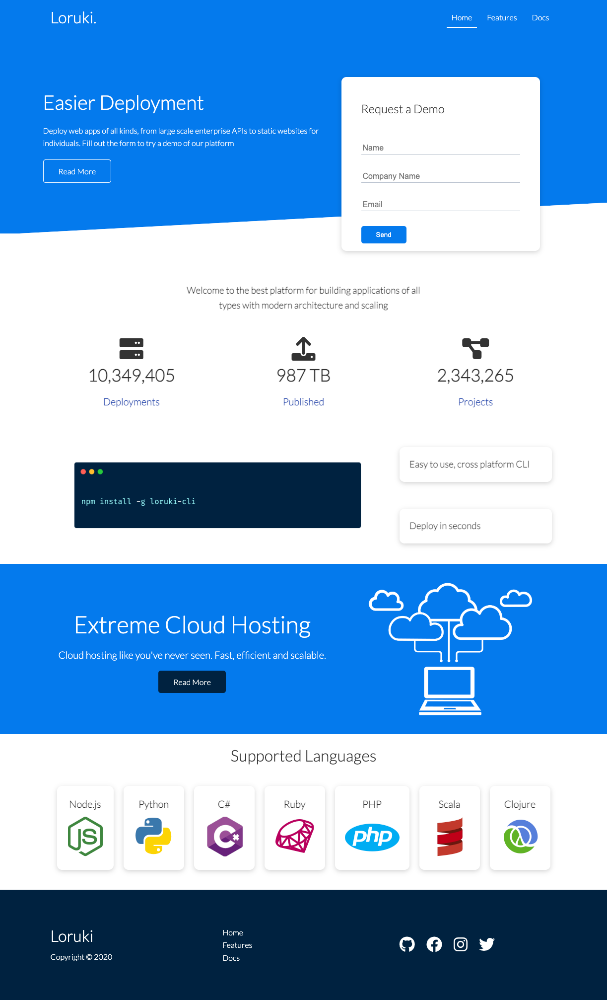

# Cloud Platform 

## License
No license in place

   
## Description
This is a sample, responsive designed  website for a fictitious cloud company. It was created using HMTL and CSS. 

## Table of Contents

- [License](#license)
- [Description](#description)
- [Installation](#installation)
- [Usage](#usage)
- [Visuals](#visuals)
- [Tests](#tests)
- [Deployed Link](#deployed-link)

## Installation
None

## Usage
It can be used as a template.

## Visuals

## Tests
None

## Deployed Link
https://enchanting-swan-07ab30.netlify.app/
